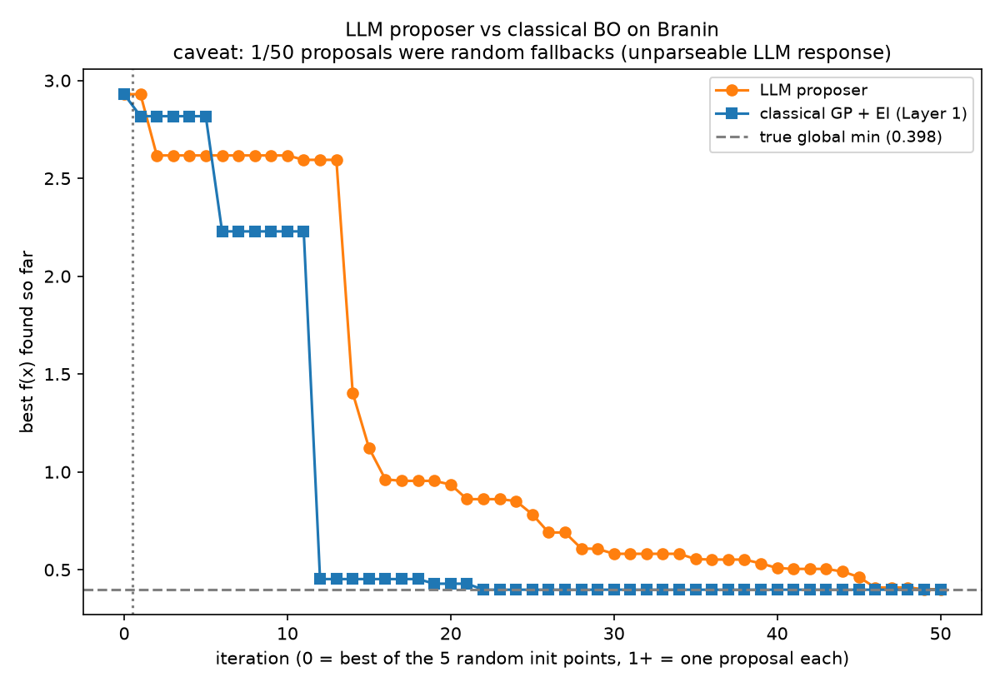
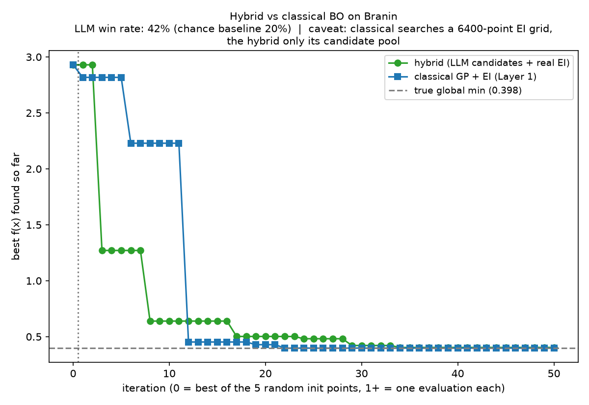
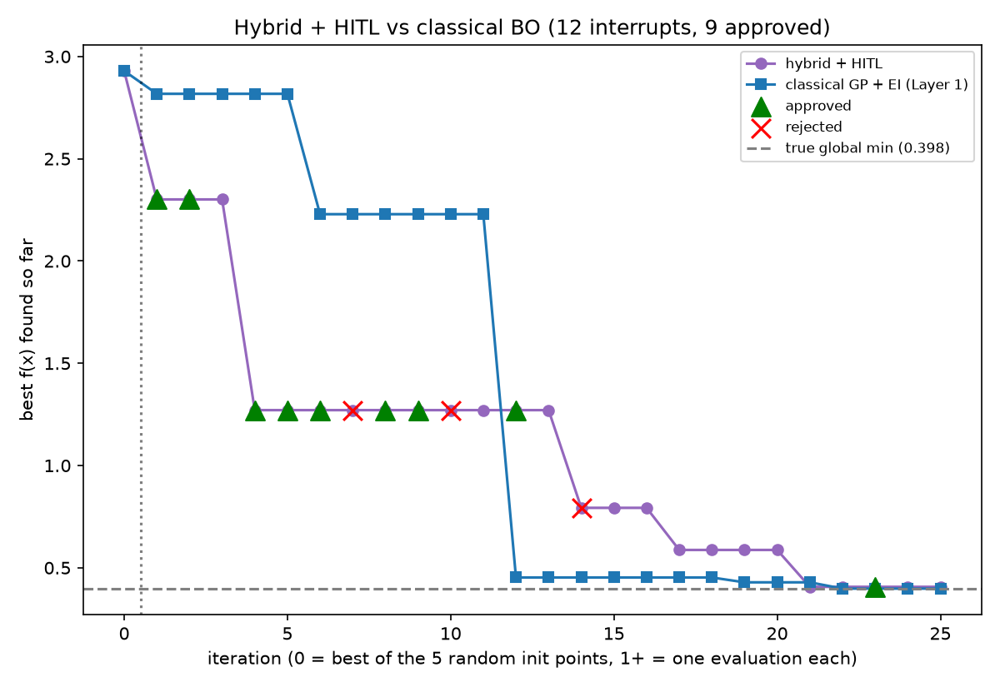

# BayOAgent

Bayesian optimization, built up in four layers — from the classical algorithm,
to an LLM doing the same job, to the two combined, to a version that stops and
asks a human before spending budget on a risky experiment.

Every layer optimizes the same function and starts from the same five random
points, so the curves can be compared directly.

## The problem

All four layers minimize the **Branin function**, a standard 2D benchmark:

- Domain: `x1` in `[-5, 10]`, `x2` in `[0, 15]`
- Three global minima, all with value **0.397887**

The optimizer never sees the formula. It only sees the points it has tried and
the values it got back — the same situation you're in with a real experiment
that is slow or expensive to run. The goal is to find the minimum in as few
evaluations as possible.

## Layer 1 — Classical Bayesian optimization

The textbook version, written by hand rather than pulled from a BO library.

Two pieces do the work:

1. **Surrogate model** — a Gaussian Process fitted to everything measured so
   far. It predicts a mean and an uncertainty at any point.
2. **Acquisition function** — Expected Improvement (EI), written out
   explicitly. This is the part that makes the actual explore-vs-exploit
   decision, so it is worth understanding rather than importing.

The loop: EI picks the next point, we evaluate Branin there, refit the GP,
repeat.


The left panel shows where EI chose to sample. It clusters around the three
basins, which is exactly what it should do. The right panel is the convergence
curve.

| | value |
|---|---|
| True minimum | 0.3979 |
| Found by GP + EI | **0.3982** |

This is the baseline every later layer is measured against.

## Layer 2 — LLM instead of GP + EI

Same loop, but the GP and the EI math are removed. The history is formatted as
text, handed to an LLM (`openai/gpt-oss-120b` via Groq), and the LLM's proposed
point is used directly.



The LLM does get there — 0.4007 after 50 iterations — but it takes far longer.
Classical BO is under 0.5 by iteration 12; the LLM needs about 45.

### The permuted-feedback check

This is the important experiment in this layer. It comes from the paper *LLMs
for Bayesian Optimization in Scientific Domains: Are We There Yet?*

The idea: if the LLM is genuinely reasoning from the feedback, then scrambling
the y-values it sees should wreck its performance. If it barely changes, the
LLM was never really using the feedback — it was just producing
plausible-looking points.


| | value |
|---|---|
| True minimum | 0.3979 |
| LLM, real feedback | 0.4007 |
| LLM, permuted feedback | **2.4630** |
| GP + EI | 0.3982 |

The permuted run never gets going. That is the answer we wanted: the LLM
**is** using the feedback, not pattern-matching its way to reasonable-looking
coordinates.

One caveat, shown on the figure itself: 12 of the 50 permuted proposals came
back unparseable and fell through to a random point. So part of that flat
orange line is random search rather than a confused LLM. The conclusion still
holds, but it is not a clean 50-out-of-50 result.

## Layer 3 — Hybrid: LLM proposes, EI decides

The LLM is good at suggesting interesting regions but bad at the precise
numerical trade-off. So split the job:

1. Fit a GP on the history, same as Layer 1.
2. Ask the LLM (`openai/gpt-oss-120b`) for 5 diverse candidate points.
3. Add 20 random filler candidates.
4. Score all 25 with real EI and evaluate the winner.

The LLM never gets the final say. It only decides what goes on the shortlist.
Because the random fillers are scored by the same EI, there's a built-in
control: how often does an LLM candidate actually beat all 20 random ones?



| | value |
|---|---|
| True minimum | 0.3979 |
| Hybrid best found | **0.4038** |
| GP + EI | 0.3982 |
| LLM candidate win rate | 42% (21/50) |
| Chance baseline | 20% (5 of 25 slots) |

The win rate is the real result here. The LLM holds 5 of 25 candidate slots,
so pure chance would be 20%. It wins 42% — roughly twice as often as chance.
The LLM's suggestions are genuinely better than random, even though it can't
be trusted to pick the final point.

Look at the early part of the green curve: the hybrid drops below 1.0 by
iteration 3, where classical takes 12. Good candidates help most at the start,
when the GP knows almost nothing.

**Caveat, also printed on the figure:** classical BO maximizes EI over a
6400-point grid, while the hybrid only scores its 25 candidates. So part of
the late-stage gap is classical having a much finer search, not better
judgment. This is not a fully apples-to-apples comparison.

## Layer 4 — Hybrid plus a human in the loop

The Layer 3 loop wrapped in LangGraph, with a real `interrupt()` that pauses
the run and waits for a human before evaluating certain points.

### What triggers the interrupt, and why

The gate is **GP uncertainty (sigma)**, not EI and not "did the LLM pick it."

EI already balances explore and exploit. Overriding it because a point looks
unusual is just second-guessing math that already accounts for that. Sigma
answers a different question: *how far is this from anything we have actually
measured?* That is the question a person running an expensive experiment
actually asks — not "is the math right" but "are we about to spend real budget
somewhere we know nothing about."

In this project sigma sits near 1 close to a measured point and 10-40 in
genuinely unexplored territory, so the threshold is set at 20.

### What rejection does

If the human rejects, the loop runs the **highest-EI candidate that is already
below the sigma threshold**.

The obvious first instinct — substitute a random point — is actively wrong
here. A random point in a mostly-unexplored domain is usually *more* uncertain
than the one that was just rejected, so the veto would increase exactly the
risk it exists to reduce. An earlier version of this code did that, and at one
rejection it swapped a sigma-36.9 point for a sigma-44.9 one. Falling back
inside the already-scored pool makes "reject" mean what a person means by it:
don't gamble, run the best option we already understand.



Green triangles are approvals, red crosses are rejections.

| | value |
|---|---|
| True minimum | 0.3979 |
| Hybrid + HITL best found | **0.4068** |
| GP + EI | 0.3982 |
| Interrupts fired | 12 of 25 iterations |
| Approved / rejected | 9 / 3 |
| LLM candidate win rate | 48% (12/25) |
| Chance baseline | 20% |

The win rate is measured on the EI scoring, **before** any human veto. That
matters: vetoing an LLM candidate is a fact about the human, not evidence the
candidate was bad, so counting it as a loss for the LLM would understate it.

The headline result is that a human vetoed 3 of 25 experiments and the run
still landed at 0.4068 — within 0.009 of the true minimum. Oversight cost
almost nothing in final quality.

## Results across all four layers

Final value after the full run:

| Layer | Method | Best found | Gap from true min |
|---|---|---|---|
| 1 | Classical GP + EI | 0.3982 | 0.0003 |
| 2 | LLM alone | 0.4007 | 0.0028 |
| 2 | LLM, permuted feedback | 2.4630 | 2.0651 |
| 3 | Hybrid (LLM + EI) | 0.4038 | 0.0059 |
| 4 | Hybrid + human in the loop | 0.4068 | 0.0089 |

Final value alone is misleading, though — every working method lands within
0.01 of the answer. What actually separates them is **how many evaluations it
took to get there**:

| Method | to < 1.0 | to < 0.5 | to < 0.1 | to < 0.01 |
|---|---|---|---|---|
| Classical GP + EI | 12 | 12 | 12 | 22 |
| LLM alone | 15 | 21 | 44 | 49 |
| LLM, permuted | never | never | never | never |
| Hybrid | **3** | **8** | 24 | 34 |
| Hybrid + HITL | 4 | 14 | **21** | **21** |

(Iteration index; 0 is the best of the five random starting points.)

## What the four layers add up to

- **Classical BO works and is hard to beat.** It is the most sample-efficient
  method here at tight tolerances, and it costs nothing per iteration.
- **An LLM alone is a weak optimizer.** It converges, but roughly four times
  slower, and each step costs an API call.
- **The LLM is genuinely reasoning, not bluffing.** The permuted-feedback run
  collapses. That is the strongest single result in this repo.
- **The hybrid gets the best of both early on.** LLM candidates beat random
  ones at twice the chance rate, and the hybrid reaches a rough answer in a
  quarter the iterations. It gives up some late-stage precision.
- **Human oversight is close to free.** Three vetoes out of 25 experiments,
  and the result barely moved. The cost of asking is far lower than the cost
  of a wasted expensive experiment.

## Running it

Needs Python 3.14 and a `.env` in the project root:

```
GROQ_API_KEY=your_key_here
```

Install and run:

```bash
uv sync                                              # or: pip install -r requirements.txt

python3 Layer_1/layer1_branin_bo.py                  # no API key needed
python3 Layer_2/layer2_llm_proposer.py --n-iter 50
python3 Layer_2/layer2_llm_proposer.py --permute --n-iter 50
python3 Layer_3/layer3_hybrid.py --n-iter 50
python3 Layer_4/layer4_hitl.py --n-iter 25           # will prompt you [y/n]
```

Useful flags:

```bash
--dry-run                    # run the whole harness with no API calls, no key needed
--replot RESULTS_JSON        # rebuild a plot from saved results, no API calls
--auto-approve               # Layer 4: skip the prompts, always approve
--auto-reject                # Layer 4: skip the prompts, always reject
```

Sample-efficiency breakdown for a saved Layer 2 run:

```bash
python3 Layer_2/efficiency_analysis.py --file Layer_2/layer2_results.json
```

## Repo layout

```
Layer_1/  layer1_branin_bo.py      GP + EI, written by hand
Layer_2/  layer2_llm_proposer.py   LLM replaces GP + EI
          efficiency_analysis.py   iterations-to-tolerance from a results file
Layer_3/  layer3_hybrid.py         LLM proposes candidates, EI picks
Layer_4/  layer4_hitl.py           LangGraph interrupt on high uncertainty
```

Each layer imports from the one below it, so Layer 1's `branin`,
`expected_improvement` and `run_bo` are the single source of truth throughout.
Every layer re-runs Layer 1 for its comparison curve.

Each run also writes a `*_results.json` next to its plot with the full
trajectory, the reasoning the LLM gave at each step, and (Layer 4) the
approval log.

**Note on the images:** filenames without a trailing number are the final
runs. Numbered ones (`layer2_comparison1.png`, `layer3_comparison1.png` and so
on) are earlier iterations kept while tuning.
